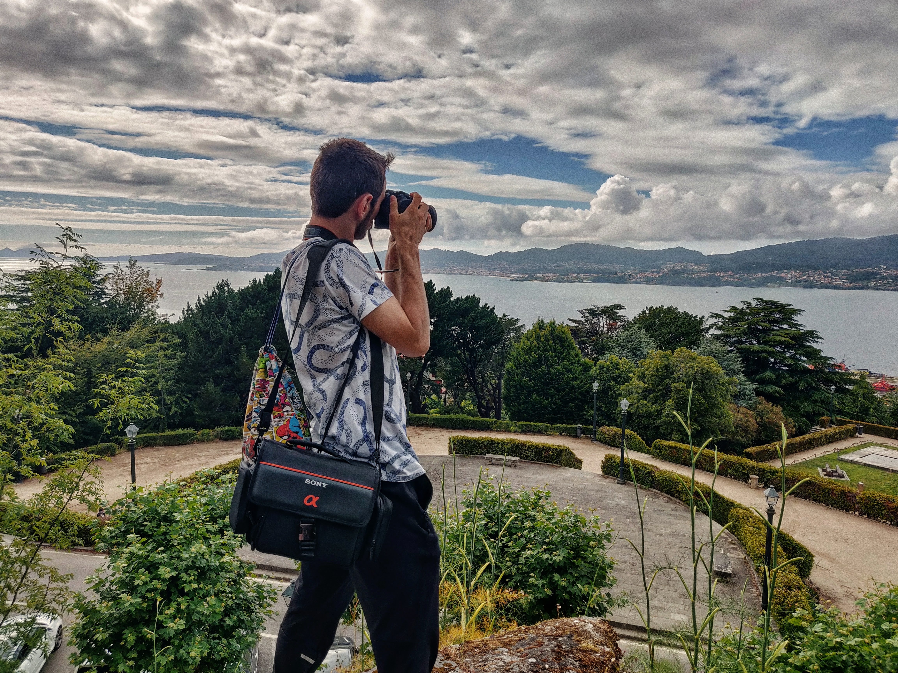
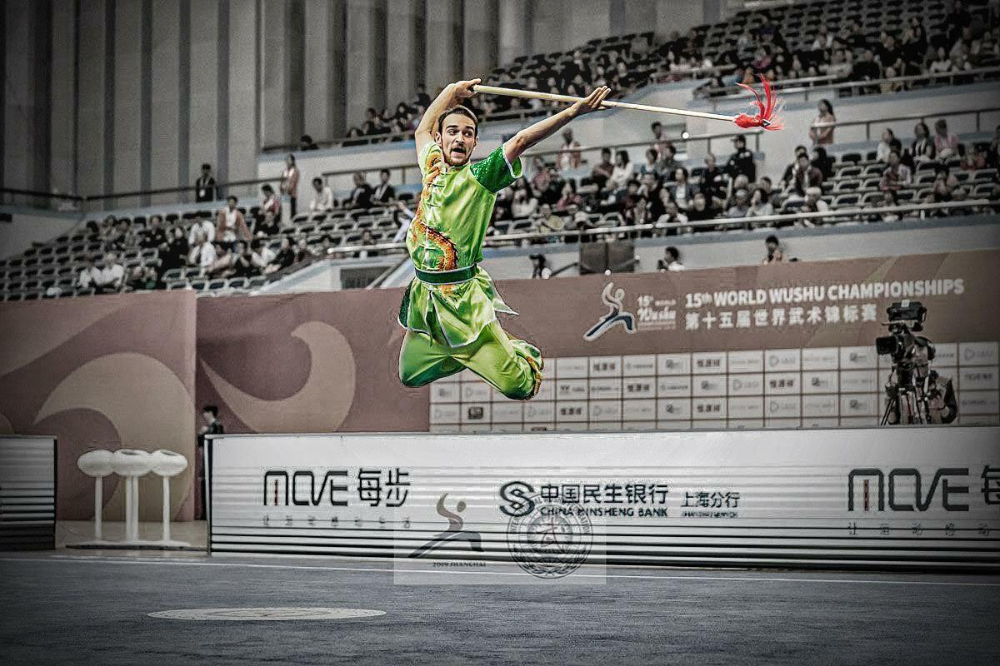

   

<html>
<head>
  <link rel="stylesheet" href="css/styles.css">
</head>

<body>
<h1>HELLO!</h1>

My name is <b>Víctor de la Plaza Schnieper</b>.

I am a young <b>architect</b>, graphic <b>designer</b> and <b>3D artist</b> living in Madrid. I love <b>photography</b>, artistic <b>drawing</b> and <b>travelling</b>. I consider myself a geek of development of new <b>technologies and computers</b>.  I am a fast learner, a very curious and self-taught person who loves to gain <b>experience</b> every day. 

    
    
<em>Vigo, Spain</em> | <b>2019</b>

I am an elite <b>Wushu (Kung-Fu)</b> athlete and a member of the <b>Spanish national team</b>. I also train in the <b>High Performance Centre</b> in Madrid. I have been practicing this sport since I was a <b>child</b> and it is now part of my life.

    
    
<em>Shanghai, China</em> | <b>2019</b>

</body>
</html>


