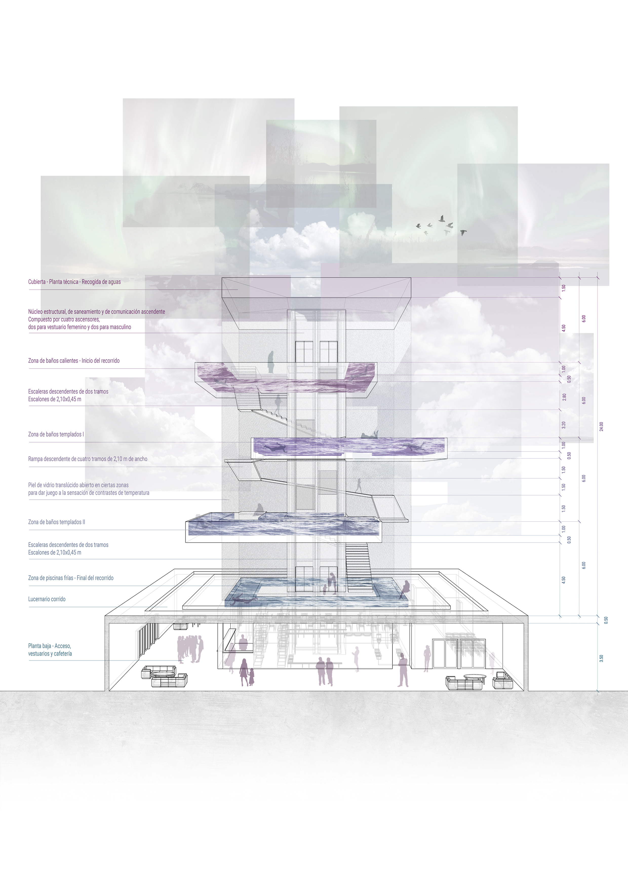
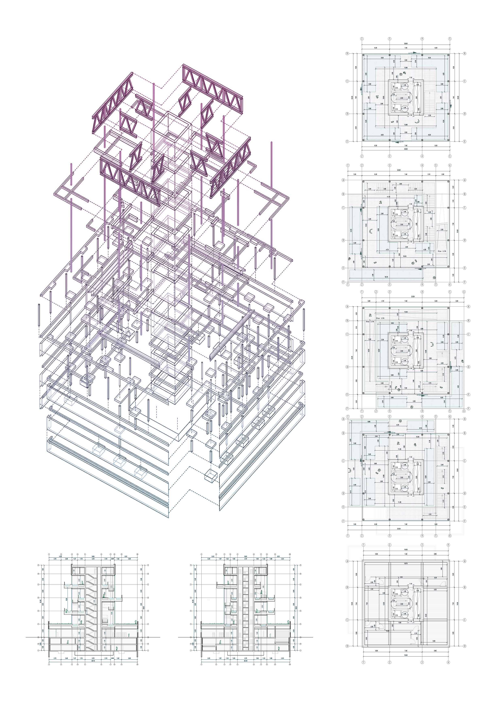
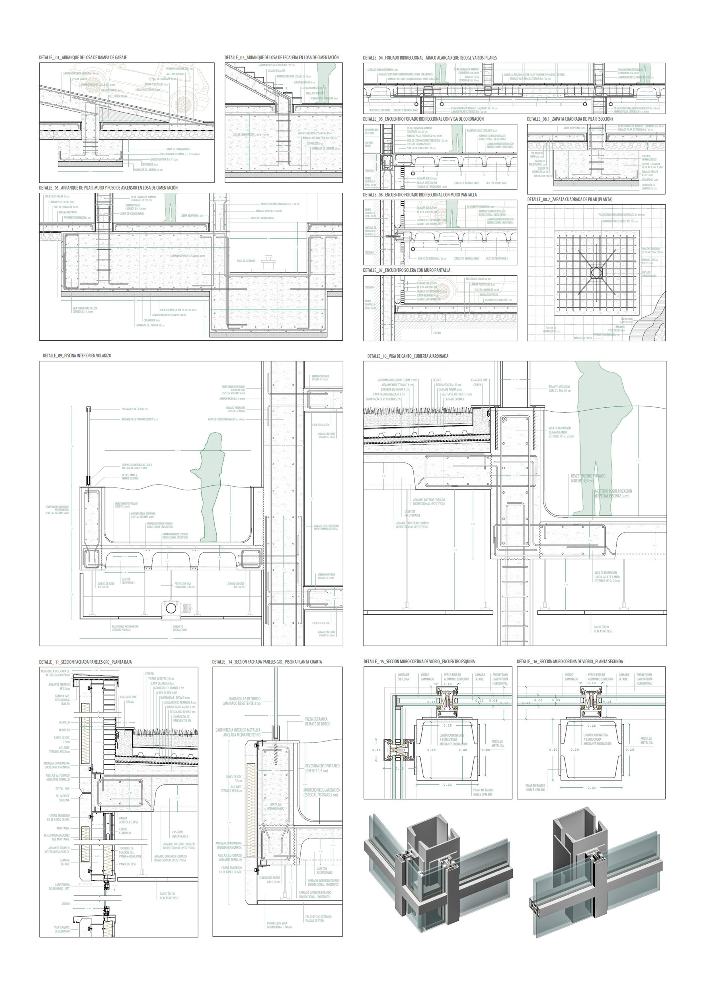



<html>
    <head>
        <link rel="stylesheet" href="css/poststyle.css">
    </head>
    <body>
        
The objective of the project is the creation of a <b>thermal bath building</b>, or <b>hotspot</b>, in Reykjavik, Iceland. It will take into account both the problematic <b>climate</b> of this location, and the lack of <b>light</b> due to the short duration of the days, as well as the contrast in <b>temperature</b> between inside and outside.

        
To this end, it was decided to operate in the shape of a <b>tower</b>, dividing the project in two parts: a great square <b>base</b> that will house the uses of reception, changing rooms and cafeteria, all wrapped in an opaque <b>GRC</b> skin; and a series of <b>out-of-phase platforms</b> that will contain the pools, these in turn, wrapped in a <b>glass</b> skin that will allow light to enter from any point.

        <!-- Slideshow container -->
        

        <!-- Full-width images with number and caption text -->
        

            
1 / 3

                
            
<em>Main elevation</em>

        

        

            
2 / 3

                
            
<em>Structure Axo | Plans | Sections</em>

        

        

            
3 / 3

                
            
<em>Construction details</em>

        

        <!-- Next and previous buttons -->
        <a class="prev" onclick="plusSlides(-1)">&#10094;</a>
        <a class="next" onclick="plusSlides(1)">&#10095;</a>
        

        <!-- The dots/circles -->
        

            
            
            
        

            
    </body>
</html>


